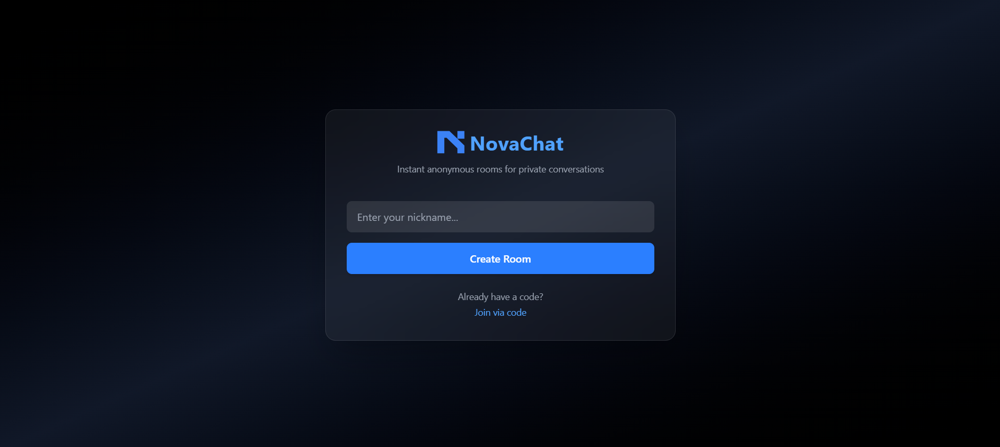
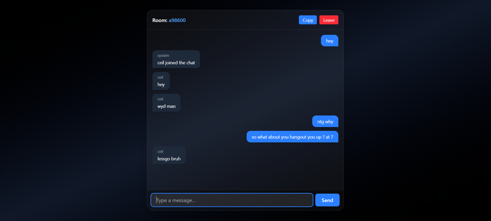

# NovaChat — Real-Time Chat Application

NovaChat is a real-time chat application built using the MERN stack and Socket.IO. It allows users to create or join anonymous chat rooms and communicate instantly through a clean, responsive interface.

---

## Live Demo

https://nova-chat-wwvg.vercel.app/

---

## Preview

### Home Page


### Chat Room


---

## Features

- Real-time messaging using Socket.IO  
- Anonymous chat rooms (no authentication required)  
- Shareable room links and codes  
- Instant message synchronization across users  
- Clean and responsive user interface  

---

## Tech Stack

**Frontend**
- React (Vite)
- Tailwind CSS

**Backend**
- Node.js
- Express.js
- Socket.IO

**Deployment**
- Frontend: Vercel  
- Backend: Render  

---

## Architecture Overview

Client communicates with the server using WebSockets (Socket.IO).  
The server manages rooms and broadcasts messages to connected users in real time.

---

## Run Locally

```bash
# Clone the repository
git clone https://github.com/piratesofsi/novaChat.git

# Frontend
cd client
npm install
npm run dev

# Backend
cd server
npm install
node server.js
